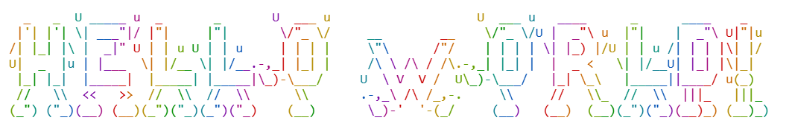
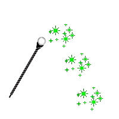
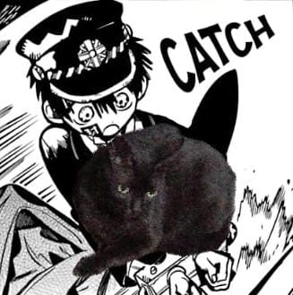
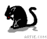
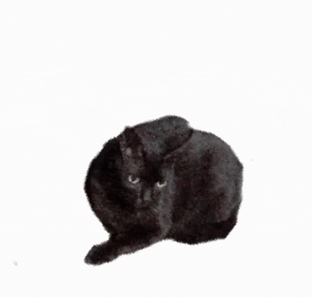
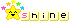

##  Olá! Seja bem vindo(a) ao meu perfil👋🐱

- 🌱 Atualmente estou aprendendo Python e Cibersegurança ╰(*°▽°*)╯
- 🎵 Música favorita: Dreamer - Laufey
- 📚 Livro favorito: Anne de Green Gables
- 🎣 Fun fact: eu gosto de pescar no Stardew Valley
  <!-- adicionar anedota -->

  
  
  
  
  
  
  

#

### Meu progresso no Roadmap 🎉 

#

#### Cobrinha 🐍
<picture align="center">
  <source media="(prefers-color-scheme: dark)" srcset="https://raw.githubusercontent.com/annyvict/annyvict/output/github-contribution-grid-snake-dark.svg">
  <source media="(prefers-color-scheme: light)" srcset="https://raw.githubusercontent.com/annyvict/annyvict/output/github-contribution-grid-snake-dark.svg">
  
</picture>
